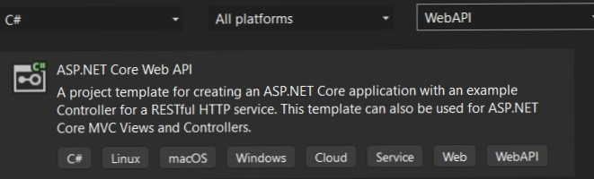

# Welcome to my client-server web application!

## In this readme file, I provide you with some information about the backend side of my application.

I hope it will help you truly appreciate the executed work. I really invest a piece of yourself in this project, and I hope you will really enjoy it. :) So, let's start with an introduction!

I've decided to develop a web tamagotchi application (so it was a good task from the Innowise team) where you can store and manage your virtual pets. During the process of completing this task, I've improved my knowledge in .NET and MVC technologies. Let's talk a little bit about the technology stack I used in my application.

## Technology Stack

So, the project has been written on .NET 6 using the ASP.NET Core Web API project type.



The communication is simple and is implemented using HTTP calls, following REST API principles.

I used MS SQL Server to store data in the database and Entity Framework as the ORM. I used the code-first approach. With the ApplicationContext class, I set up relationships between tables in the database.
```csharp
public class ApplicationContext:DbContext
    {
        public DbSet<Pet> Pets { get; set; } = null!;
        public DbSet<Farm> Farms { get; set; } = null!;
        public DbSet<User> Users { get; set; } = null!;

        //... Connection

        protected override void OnModelCreating(ModelBuilder model)
        {
            model.Entity<User>()
                .HasOne(u => u.MyFarm)
                .WithOne(f=>f.MyUser)
                .HasForeignKey<Farm>(f => f.UserId);

            model.Entity<Pet>()
                .HasOne(e => e.Farm)
                .WithMany(d => d.Pets)
                .HasForeignKey(e => e.FarmId);

            model.Entity<User>()
                .HasMany(s => s.MyColaborators)
                .WithMany(c => c.IAmColaborator)
                .UsingEntity(j => j.ToTable("UserColab"));

            model.Entity<PetFeeding>()
                .HasOne(o => o.MyPet)
                .WithMany(e => e.Feedings)
                .HasForeignKey(j => j.PetId);

            model.Entity<PetDrinking>()
                .HasOne(o => o.MyPet)
                .WithMany(m => m.Drinkings)
                .HasForeignKey(fk => fk.PetId);
        }
    }
```
So I used Repository pattern for my repository. I have a list of "Entity repository" like Farm repository, Pet repository and so on. And also I have repository Manager for managing all repositories:
```csharp
public class RepositoryManager : IRepositoryManager
    {
        private readonly ApplicationContext _db;
        private IUserRepository _userRepository;
        private IFarmRepository _farmRepository;
        private IPetRepository _petRepository;
        private IPetFeedingRepository _petFeedingRepository;
        private IPetDrinkingRepository _petDrinkingRepository;
        public RepositoryManager(ApplicationContext db)
        {
            _db = db;
        }

        public IUserRepository User {
            get
            {
                if (_userRepository == null)
                {
                    _userRepository = new UserRepository(_db);
                }
                return _userRepository;
            }
        
        }
        //...Other getters
    }
```

What's more I have Service layer for bisness logic of application. Here you can find some method for working with repository:
```csharp
public async Task<Farm> GetFarm(string email)
        {
            //Get current user for getting current farm
            User? curentUser = await _repository.User.GetUserByEmail(email);

            Farm? farm = await _repository.Farm.GetByCondition(x => x.UserId == curentUser.UserId, false).Result.FirstOrDefaultAsync();

            if (farm == null)
            {
                throw new CustomExeption(message: "Farm does not exist") { StatusCode = StatusCode.DoesNotExist };
            }

            return farm;
        }
 ```
 For Presentation leyer I have controllers, that handle incoming requests and send responses:
 ```csharp
    [Route("api/user")]
    [ApiController]
    public class UserController : ControllerBase
    {
        private readonly IUserService _userService;
        private readonly IMapper _mapper;

        public UserController(IUserService userService, IMapper mapper)
        {
            _userService = userService;
            _mapper = mapper;
        }

        [Authorize]
        [HttpGet]
        [Route("all-users")]
        public async Task<IActionResult> GetAllUsers()
        {
            List<User> users = await _userService.GetAll();

            List<UserDto> dtos = _mapper.Map<List<UserDto>>(users);

            string json = JsonSerializer.Serialize(dtos);

            return Ok(json);
        }
        //...Other endpoints
     }
```
For all dependences I used DI Container that create only one instance of any dependency. 

After completing all bisness requrements I used Swagger for testing endpoints and write some unit test for bisness logic:
```csharp
    public class UserServiceTests
    {
        [Fact]
        public async Task UpdateUserTest()
        {
            //Arrange
            Mock<IRepositoryManager> mockRepository = new Mock<IRepositoryManager>();
            Mock<IUserRepository> mockUserRepository = new Mock<IUserRepository>();

            User user = new User() { Email = "q" };
            UserDto userDto = new UserDto() { Email = "q" };

            UserService userService = new UserService(mockRepository.Object,null,null);
            mockRepository.Setup(x => x.User).Returns(mockUserRepository.Object);
            mockUserRepository.Setup(x => x.GetUserByEmail("q")).ReturnsAsync(user);
            mockUserRepository.Setup(x => x.Update(user)).Returns(Task.CompletedTask);
            mockRepository.Setup(r => r.Save()).Returns(Task.CompletedTask);

            //Act
            bool result = await userService.UpdateUser(userDto);

            //Assert
            Assert.True(result);
        }
    }
    
```

For more test your can visit my another github repository: https://github.com/Sir-Alexio/Innogotchi-tests